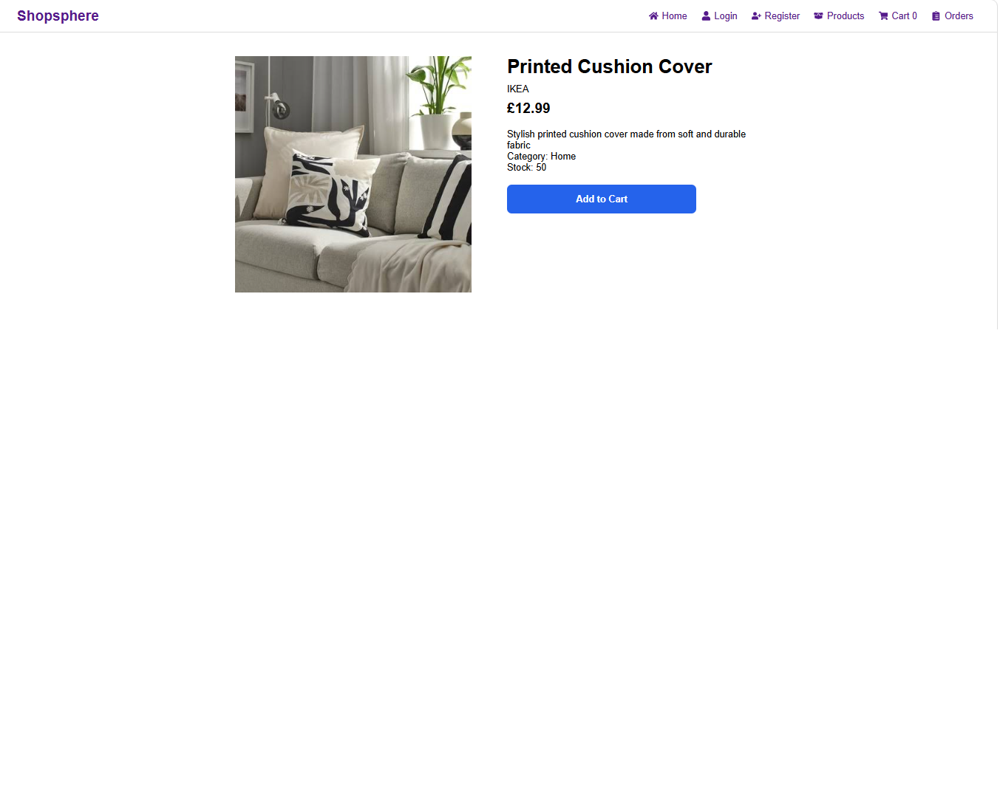
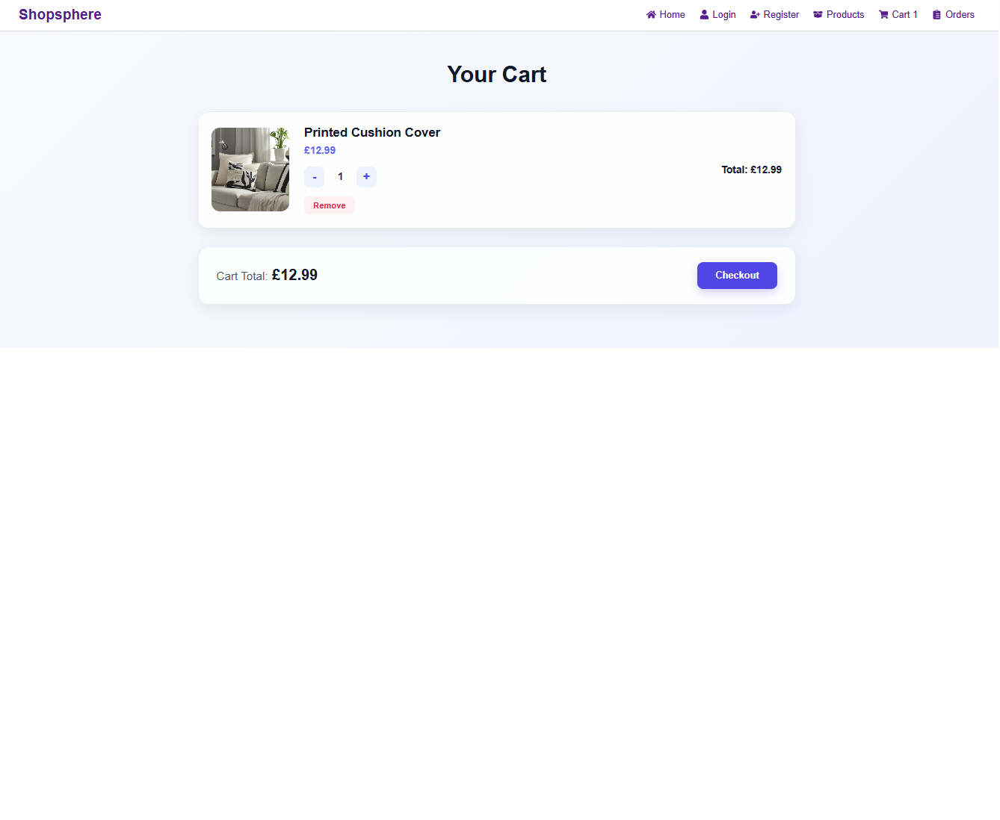
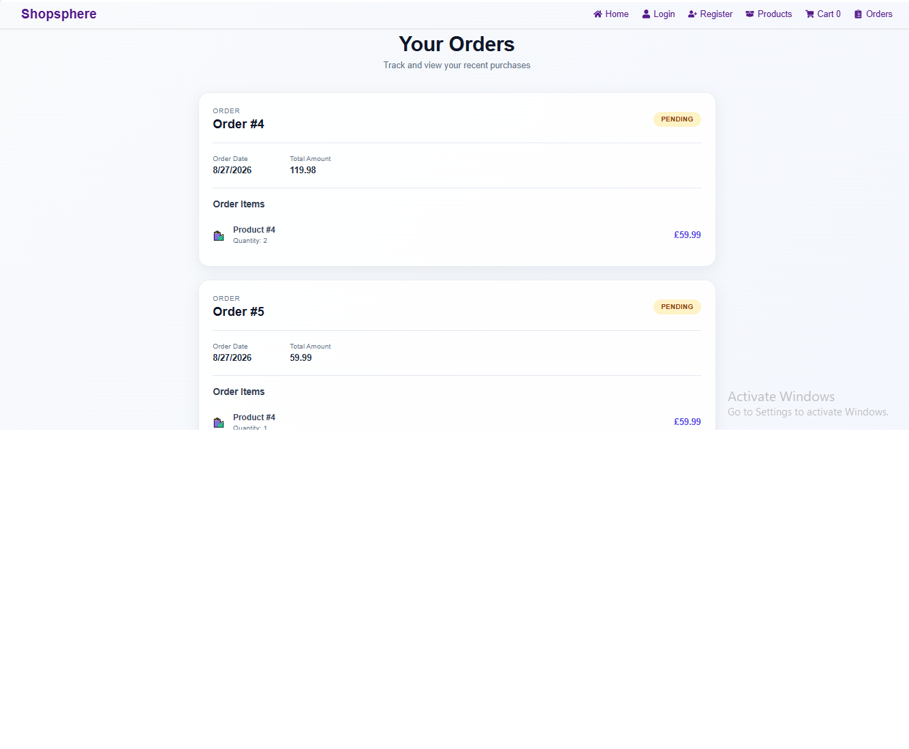

# 🛍️ ShopSphere

A full-stack e-commerce web application built with **React, TypeScript, Node.js, Express, Prisma, and PostgreSQL**.

ShopSphere allows users to browse products by category, view product details, create an account, authenticate securely, manage a shopping cart, checkout, and view their order history.

---

## 🚀 Overview

**ShopSphere** is a full-stack e-commerce project designed to demonstrate modern frontend and backend development skills.

The application follows a **client-server architecture**, where the React frontend communicates with a RESTful Express API. The backend handles authentication, product management, cart operations, and order processing using Prisma ORM with PostgreSQL.

### Key Highlights

* 🔐 JWT-based user authentication
* 🔒 Password hashing with bcrypt
* 🛍️ Product browsing and category filtering
* 📦 Product details
* 🛒 Shopping cart management
* ➕➖ Cart quantity controls
* 💰 Automatic cart total calculation
* 🧾 Checkout and order creation
* 📋 Order history
* 🗄️ Relational PostgreSQL database
* 🔗 RESTful API architecture
* ⚛️ React + TypeScript frontend
* 🎨 Custom CSS styling
* 📱 Component-based UI architecture

---

## ✨ Features

### 🔐 Authentication

* User registration
* User login
* Password hashing using bcrypt
* JWT token generation
* Protected backend routes
* Authenticated requests using Bearer tokens
* User-specific cart and order data

### 🛍️ Product Browsing

Users can:

* View available products
* Browse products by category
* View individual product details
* See product name, brand, price, description and stock
* Navigate from category cards to filtered product listings

### 🛒 Shopping Cart

Users can:

* Add products to their cart
* Increase product quantity
* Decrease product quantity
* Remove products
* View individual item totals
* View the overall cart total
* See the cart item count in the navigation bar

### 🧾 Checkout & Orders

The checkout flow:

1. Retrieves the authenticated user's cart
2. Calculates the order total
3. Creates an order
4. Creates associated order items
5. Clears the cart
6. Redirects the user to the Orders page

Users can then view their previous orders and order status.

### 🧭 Navigation

The application includes navigation for:

* Home
* Login
* Register
* Products
* Cart
* Orders

React Icons are used to improve the navigation experience.

---

## 🛠️ Tech Stack

### Frontend

| Technology       | Purpose                           |
| ---------------- | --------------------------------- |
| React 19         | UI development                    |
| TypeScript       | Type safety                       |
| Vite             | Development server and build tool |
| React Router DOM | Client-side routing               |
| React Icons      | UI icons                          |
| CSS              | Styling                           |

### Backend

| Technology | Purpose                         |
| ---------- | ------------------------------- |
| Node.js    | JavaScript runtime              |
| Express 5  | REST API framework              |
| TypeScript | Type-safe backend development   |
| Prisma 7   | ORM and database access         |
| PostgreSQL | Relational database             |
| JWT        | Authentication                  |
| bcrypt     | Password hashing                |
| CORS       | Cross-origin API requests       |
| dotenv     | Environment variable management |

---

## 🏗️ Architecture

ShopSphere follows a client-server architecture:

```text
┌───────────────────────────────┐
│        React Frontend         │
│                               │
│ React + TypeScript + Vite     │
│ React Router + CSS            │
└───────────────┬───────────────┘
                │
                │ HTTP / REST API
                ▼
┌───────────────────────────────┐
│        Express Backend        │
│                               │
│ Routes → Controllers          │
│ Authentication Middleware     │
└───────────────┬───────────────┘
                │
                │ Prisma ORM
                ▼
┌───────────────────────────────┐
│        PostgreSQL             │
│                               │
│ Users                         │
│ Products                      │
│ Categories                    │
│ Cart / Cart Items             │
│ Orders / Order Items          │
└───────────────────────────────┘
```

---

## 🔐 Authentication Flow

ShopSphere uses **JWT-based authentication**.

### Registration

```text
User
 ↓
Registration Form
 ↓
POST /api/auth/register
 ↓
Password hashed using bcrypt
 ↓
User stored in PostgreSQL
```

### Login

```text
User
 ↓
Login Form
 ↓
POST /api/auth/login
 ↓
Credentials verified
 ↓
JWT generated
 ↓
Token stored in localStorage
```

### Protected Requests

Authenticated requests send the JWT using:

```http
Authorization: Bearer <token>
```

The backend authentication middleware verifies the token and attaches the authenticated user's ID to the request.

---

## 📄 Application Pages

### Home

Landing page containing:

* Hero section
* Shop Now CTA
* Category cards
* Women
* Men
* Kids
* Home

### Login

Allows existing users to authenticate using email and password.

### Register

Allows new users to create an account.

### Products

Displays products and supports category-based browsing.

### Product Details

Displays:

* Product image
* Product name
* Brand
* Price
* Description
* Category
* Stock
* Add to Cart functionality

### Cart

Displays:

* Product image
* Product name
* Price
* Quantity controls
* Remove action
* Item total
* Cart total
* Checkout button

### Orders

Displays:

* Order ID
* Order date
* Order status
* Total amount
* Order items

---

## 🔗 REST API

### Authentication

| Method | Endpoint             | Authentication |
| ------ | -------------------- | -------------- |
| POST   | `/api/auth/register` | Public         |
| POST   | `/api/auth/login`    | Public         |
| POST   | `/api/auth/me`       | 🔒 Protected   |

### Products

| Method | Endpoint                             | Authentication |
| ------ | ------------------------------------ | -------------- |
| GET    | `/api/products`                      | Public         |
| GET    | `/api/products/category/:categoryId` | Public         |
| GET    | `/api/products/:id`                  | Public         |
| POST   | `/api/products`                      | Public         |
| PUT    | `/api/products/:id`                  | Public         |
| DELETE | `/api/products/:id`                  | Public         |
| PATCH  | `/api/products/images`               | Public         |

### Categories

| Method | Endpoint        | Authentication |
| ------ | --------------- | -------------- |
| POST   | `/api/category` | Public         |

### Cart

| Method | Endpoint               | Authentication |
| ------ | ---------------------- | -------------- |
| POST   | `/api/cart`            | 🔒 Protected   |
| POST   | `/api/cart/items`      | 🔒 Protected   |
| GET    | `/api/cart`            | 🔒 Protected   |
| PATCH  | `/api/cart/:productId` | 🔒 Protected   |
| DELETE | `/api/cart/:productId` | 🔒 Protected   |

### Orders

| Method | Endpoint                | Authentication |
| ------ | ----------------------- | -------------- |
| POST   | `/api/order`            | 🔒 Protected   |
| GET    | `/api/order`            | 🔒 Protected   |
| GET    | `/api/order/:id`        | 🔒 Protected   |
| PATCH  | `/api/order/:id/status` | 🔒 Protected   |

> **Note:** Product/category management endpoints are currently public at the API level. Role-based admin authorization is planned as a future enhancement.

---

## 🗄️ Database Design

ShopSphere uses **PostgreSQL** with **Prisma ORM**.

### Main Models

```text
User
 │
 |
 ├── Cart
 │    └── CartItem
 │          └── Product
 │
 └── Order
      └── OrderItem
             └── Product

Category
   │
   └── Product
```

### Models

#### User

Stores registered user information and authentication credentials.

#### Category

Stores product categories.

#### Product

Stores:

* Name
* Brand
* Price
* Image
* Stock
* Description
* Category

#### Cart

Represents a user's shopping cart.

#### CartItem

Connects products with carts and stores quantities.

#### Address

Stores user address information in the database schema.

#### Order

Stores:

* User
* Total amount
* Status
* Creation date
* Updated date

#### OrderItem

Stores:

* Product
* Quantity
* Price
* Order relationship

---

## 📁 Project Structure

```text
ShopSphere/
│
├── README.md
│
├── frontend/
│   ├── src/
│   │   ├── components/
│   │   │   └── Navbar.tsx
│   │   │
│   │   ├── pages/
│   │   │   ├── Home.tsx
│   │   │   ├── Login.tsx
│   │   │   ├── Register.tsx
│   │   │   ├── Products.tsx
│   │   │   ├── ProductDetails.tsx
│   │   │   ├── Cart.tsx
│   │   │   └── Orders.tsx
│   │   │
│   │   ├── styles/
│   │   │   ├── Home.css
│   │   │   ├── Navbar.css
│   │   │   ├── Products.css
│   │   │   ├── ProductDetails.css
│   │   │   ├── Cart.css
│   │   │   ├── Orders.css
│   │   │   ├── Login.css
│   │   │   └── Register.css
│   │   │
│   │   ├── types/
│   │   │
│   │   ├── App.tsx
│   │   ├── main.tsx
│   │   └── index.css
│   │
│   └── package.json
│
├── backend/
│   ├── src/
│   │   ├── config/
│   │   │
│   │   ├── controllers/
│   │   │   ├── authController.ts
│   │   │   ├── productController.ts
│   │   │   ├── categoryController.ts
│   │   │   ├── cartController.ts
│   │   │   └── orderController.ts
│   │   │
│   │   ├── middleware/
│   │   │   └── authMiddleware.ts
│   │   │
│   │   ├── routes/
│   │   │   ├── authRoutes.ts
│   │   │   ├── productRoutes.ts
│   │   │   ├── categoryRoutes.ts
│   │   │   ├── cartRoutes.ts
│   │   │   └── orderRoutes.ts
│   │   │
│   │   ├── app.ts
│   │   └── server.ts
│   │
│   ├── prisma/
│   │   └── schema.prisma
│   │
│   └── package.json
│
└── .gitignore
```

---

## ⚙️ Getting Started

### Prerequisites

Make sure you have installed:

* Node.js
* npm
* PostgreSQL
* Git

---

## 📥 Installation

Clone the repository:

```bash
git clone https://github.com/nidhi-baberwal/shopsphere.git
```

Navigate into the project:

```bash
cd ShopSphere
```

---

## 🎨 Frontend Setup

Navigate to the frontend:

```bash
cd frontend
```

Install dependencies:

```bash
npm install
```

Start the development server:

```bash
npm run dev
```

The frontend will be available through the Vite development server.

---

## 🖥️ Backend Setup

Open another terminal and navigate to the backend:

```bash
cd backend
```

Install dependencies:

```bash
npm install
```

---

## 🔑 Environment Variables

Create a `.env` file inside the backend directory.

Example:

```env
PORT=5000

DATABASE_URL="your_postgresql_database_url"

JWT_SECRET="your_secure_jwt_secret"
```

> Never commit your `.env` file or expose your JWT secret or database credentials publicly.

---

## 🗄️ Database Setup

After configuring PostgreSQL and your `DATABASE_URL`, generate the Prisma client:

```bash
npx prisma generate
```

Run the database migration:

```bash
npx prisma migrate dev
```

---

## ▶️ Run the Backend

Start the backend in development mode:

```bash
npm run dev
```

The API runs on:

```text
http://localhost:5000
```

---

## 📦 Production Build

### Frontend

Create a production build:

```bash
npm run build
```

Preview the production build:

```bash
npm run preview
```

### Backend

Compile TypeScript:

```bash
npm run build
```

Start the compiled backend:

```bash
npm start
```

---

## 📜 Available Scripts

### Frontend

```bash
npm run dev
```

Starts the Vite development server.

```bash
npm run build
```

Type-checks and builds the frontend for production.

```bash
npm run lint
```

Runs ESLint.

```bash
npm run preview
```

Previews the production build locally.

### Backend

```bash
npm run dev
```

Runs the backend using `ts-node-dev` with automatic restart.

```bash
npm run build
```

Compiles TypeScript.

```bash
npm start
```

Runs the compiled backend.

---

## 🔄 Example User Flow

```text
Register
   ↓
Login
   ↓
Browse Products
   ↓
Select Category
   ↓
View Product Details
   ↓
Add Product to Cart
   ↓
Update Quantity
   ↓
Review Cart
   ↓
Checkout
   ↓
Order Created
   ↓
Cart Cleared
   ↓
View Order History
```

---

## 🧠 Technical Concepts Demonstrated

This project demonstrates practical experience with:

### Frontend

* React functional components
* React Hooks
* `useState`
* `useEffect`
* `useParams`
* `useNavigate`
* React Router
* TypeScript interfaces and types
* Controlled form inputs
* Component props
* State updates
* API integration using `fetch`
* Conditional rendering
* Dynamic routing
* CSS component styling

### Backend

* Express REST APIs
* Route/controller separation
* Middleware
* JWT authentication
* Password hashing
* HTTP status codes
* Request validation
* Error handling
* Authenticated API requests
* Prisma ORM
* PostgreSQL relationships
* Relational data modelling

### Full-Stack Integration

* Frontend ↔ backend communication
* JWT-based authorization
* Cart state synchronization
* Order creation
* Database persistence
* REST API consumption
* Authentication-aware requests

---

## 🔮 Future Improvements

The project can be further extended with:

### 🔐 Authorization

* Admin roles
* Role-based access control
* Protected product management
* Protected category management
* Admin dashboard

### 🛒 E-commerce Improvements

* Product search
* Sorting and advanced filtering
* Wishlist
* Persistent cart state
* Product reviews and ratings
* Stock validation
* Automatic stock reduction after checkout

### 💳 Checkout

* Shipping address management
* Complete checkout form
* Payment gateway integration
* Order confirmation
* Email notifications

### 🧪 Testing

* Unit tests
* API integration tests
* React component tests
* End-to-end testing

### ⚡ Performance & Production

* Environment-based API URLs
* Production CORS configuration
* Improved loading and error states
* API request abstraction
* Better form validation
* Database transactions for checkout
* Improved error handling
* Production deployment

---

## 📌 Current Project Scope

ShopSphere currently focuses on the core e-commerce workflow:

**Authentication → Product Discovery → Cart → Checkout → Orders**

## 📸 Screenshots

### Home Page


### Products Page


### Product Details


### Cart


### Orders



---

## 🎯 Learning Objectives

ShopSphere was built to strengthen practical full-stack development skills, particularly:

* Building React applications with TypeScript
* Designing REST APIs
* Working with relational databases
* Implementing JWT authentication
* Using Prisma ORM
* Managing frontend state
* Connecting frontend and backend systems
* Designing database relationships
* Building an end-to-end e-commerce workflow

---

## 👩‍💻 Author

**Nidhi**

Frontend / Full-Stack Developer

Focused on building applications using:

**React • TypeScript • Node.js • Express • PostgreSQL • Prisma**

---

## ⭐ Project

If you find this project useful or interesting, feel free to ⭐ the repository.
